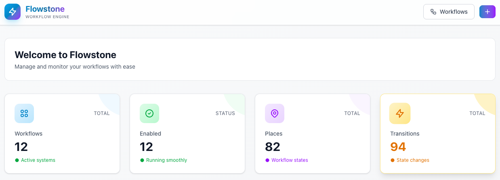
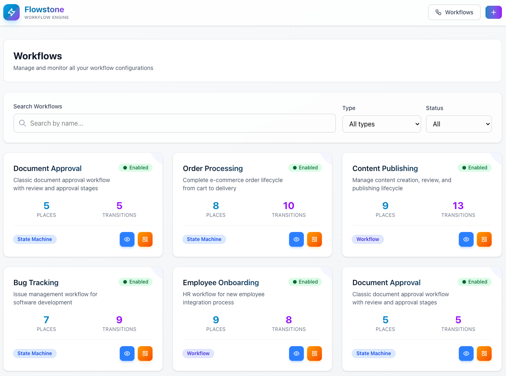

# Workflows

This page introduces the Flowstone UI for managing workflows and provides a quick guide to implementing workflows in your app.

## Screenshots

### Dashboard — Welcome to Flowstone



### Workflows — List & Filters



---

Below is a practical usage guide for adding workflow support to your models.

## Getting Started

### Model Implementation

Every model that uses workflows must implement the `Workflow` contract and use the `InteractsWithWorkflow` trait:

> **💡 Why Traits Instead of `supports` Config?**
>
> Flowstone uses a trait-based approach (not Symfony's `supports` configuration) for better Laravel developer experience. You get:
>
> - ✅ Full IDE autocomplete and type hints
> - ✅ Type safety via the `WorkflowContract` interface
> - ✅ Dynamic workflow selection at runtime
> - ✅ Self-documenting code
>
> See [detailed comparison in Configuration Guide](../02-configuration/01-configuration.md#model-integration-trait-vs-supports-configuration).

```php
<?php

namespace App\Models;

use CleaniqueCoders\Flowstone\Concerns\InteractsWithWorkflow;
use CleaniqueCoders\Flowstone\Contracts\Workflow as WorkflowContract;
use Illuminate\Database\Eloquent\Casts\Attribute;
use Illuminate\Database\Eloquent\Model;

class YourModel extends Model implements WorkflowContract
{
    use InteractsWithWorkflow;

    // Required contract methods
    public function workflowType(): Attribute
    {
        return Attribute::make(get: fn () => 'your-workflow-name');
    }

    public function workflowTypeField(): Attribute
    {
        return Attribute::make(get: fn () => 'workflow_type');
    }

    // Optional: Custom marking methods
    public function getMarking(): string
    {
        return $this->status ?? 'draft';
    }

    public function setMarking(string $marking): void
    {
        $this->status = $marking;

        // Add custom logic when state changes
        if ($marking === 'published') {
            $this->published_at = now();
        }
    }
}
```

### Workflow Configuration

#### Option 1: Database Configuration (Recommended)

Create workflows dynamically in the database:

```php
use CleaniqueCoders\Flowstone\Models\Workflow;
use CleaniqueCoders\Flowstone\Models\WorkflowPlace;
use CleaniqueCoders\Flowstone\Models\WorkflowTransition;

// Create the workflow
$workflow = Workflow::create([
    'name' => 'document-approval',
    'description' => 'Document approval process',
    'type' => 'state_machine',
    'initial_marking' => 'draft',
    'is_enabled' => true,
]);

// Add places (states)
$places = ['draft', 'review', 'approved', 'rejected'];
foreach ($places as $index => $place) {
    WorkflowPlace::create([
        'workflow_id' => $workflow->id,
        'name' => $place,
        'sort_order' => $index + 1,
    ]);
}

// Add transitions
$transitions = [
    ['name' => 'submit', 'from_place' => 'draft', 'to_place' => 'review'],
    ['name' => 'approve', 'from_place' => 'review', 'to_place' => 'approved'],
    ['name' => 'reject', 'from_place' => 'review', 'to_place' => 'rejected'],
    ['name' => 'revise', 'from_place' => 'rejected', 'to_place' => 'draft'],
];

foreach ($transitions as $index => $transition) {
    WorkflowTransition::create([
        'workflow_id' => $workflow->id,
        'name' => $transition['name'],
        'from_place' => $transition['from_place'],
        'to_place' => $transition['to_place'],
        'sort_order' => $index + 1,
    ]);
}
```

#### Option 2: Configuration File

Define workflows in `config/flowstone.php`:

```php
'custom' => [
    'document-approval' => [
        'type' => 'state_machine',
        'supports' => [App\Models\Document::class],
        'marking_store' => [
            'type' => 'method',
            'property' => 'status',
        ],
        'initial_marking' => 'draft',
        'places' => [
            'draft' => null,
            'review' => null,
            'approved' => null,
            'rejected' => null,
        ],
        'transitions' => [
            'submit' => [
                'from' => ['draft'],
                'to' => 'review',
            ],
            'approve' => [
                'from' => ['review'],
                'to' => 'approved',
            ],
            'reject' => [
                'from' => ['review'],
                'to' => 'rejected',
            ],
            'revise' => [
                'from' => ['rejected'],
                'to' => 'draft',
            ],
        ],
    ],
],
```

## Working with Workflows

### Basic Operations

```php
// Create a model instance
$document = Document::create([
    'title' => 'My Document',
    'content' => 'Content here...',
    'status' => 'draft',
]);

// Get the workflow instance
$workflow = $document->getWorkflow();

// Check current state
$currentState = $document->getMarking(); // 'draft'

// Get available transitions
$transitions = $document->getEnabledToTransitions();
// Returns: ['review' => 'Review'] for draft documents

// Check if a specific transition is possible
if ($workflow->can($document, 'submit')) {
    echo "Document can be submitted for review";
}

// Apply a transition
$workflow->apply($document, 'submit');
$document->save(); // Status is now 'review'
```

### Advanced Workflow Operations

```php
// Get all enabled transition objects (Symfony objects)
$transitionObjects = $document->getEnabledTransitions();
foreach ($transitionObjects as $transition) {
    echo $transition->getName(); // 'submit', 'approve', etc.
    echo $transition->getFroms(); // ['draft']
    echo $transition->getTos(); // ['review']
}

// Check if any transitions are available
if ($document->hasEnabledToTransitions()) {
    // Show transition buttons in UI
}

// Get roles for all available transitions
$allRoles = $document->getAllEnabledTransitionRoles();
// Returns: ['review' => ['author'], 'approve' => ['manager']]
```

## Role-Based Permissions

### Setting Up Roles in Transitions

Add role metadata to transitions:

```php
WorkflowTransition::create([
    'workflow_id' => $workflow->id,
    'name' => 'approve',
    'from_place' => 'review',
    'to_place' => 'approved',
    'meta' => [
        'roles' => ['manager', 'admin'],
        'permissions' => ['approve_documents'],
        'description' => 'Approve the document for publication',
    ],
]);
```

### Checking Permissions

```php
// Get required roles for current state transitions
$requiredRoles = $document->getRolesFromTransition();

// Get roles for specific transition
$approveRoles = $document->getRolesFromTransition('approved', 'to');

// Check if user has required roles (implement your own logic)
$userRoles = auth()->user()->roles->pluck('name')->toArray();
$canTransition = !empty(array_intersect($userRoles, $requiredRoles));

// In controller
public function transition(Request $request, Document $document)
{
    $transitionName = $request->input('transition');

    // Check workflow allows transition
    if (!$document->getWorkflow()->can($document, $transitionName)) {
        abort(422, 'Invalid transition for current state');
    }

    // Check user permissions
    $requiredRoles = $document->getRolesFromTransition();
    if (!auth()->user()->hasAnyRole($requiredRoles)) {
        abort(403, 'Insufficient permissions');
    }

    // Apply transition
    $document->getWorkflow()->apply($document, $transitionName);
    $document->save();

    return redirect()->back()->with('success', 'Status updated');
}
```

## State Machine vs Workflow

### State Machine (Single Marking)

Use for exclusive states where only one state can be active:

```php
// Example: Order processing
'type' => 'state_machine',
'places' => ['pending', 'confirmed', 'shipped', 'delivered']

// Order can only be in one state at a time
$order->getMarking(); // 'shipped' (single value)
```

### Workflow (Multiple Markings)

Use for parallel processes where multiple states can be active:

```php
// Example: Multi-step form
'type' => 'workflow',
'places' => ['step1', 'step2', 'step3', 'completed']

// Form can be in multiple states simultaneously
$form->getMarking(); // ['step1', 'step2'] (array of values)
```

## Event Handling

### Symfony Workflow Events

Listen to built-in workflow events:

```php
// In EventServiceProvider
use Symfony\Component\Workflow\Event\TransitionEvent;
use Symfony\Component\Workflow\Event\EnteredEvent;

protected $listen = [
    TransitionEvent::class => [
        WorkflowTransitionListener::class,
    ],
    EnteredEvent::class => [
        WorkflowStateEnteredListener::class,
    ],
];
```

```php
// WorkflowTransitionListener
class WorkflowTransitionListener
{
    public function handle(TransitionEvent $event)
    {
        $model = $event->getSubject();
        $transition = $event->getTransition();
        $workflow = $event->getWorkflow();

        Log::info("Workflow transition", [
            'model' => get_class($model),
            'id' => $model->id,
            'transition' => $transition->getName(),
            'from' => $transition->getFroms(),
            'to' => $transition->getTos(),
        ]);

        // Send notifications
        if ($transition->getName() === 'approve') {
            Mail::to($model->author)->send(new DocumentApprovedMail($model));
        }
    }
}
```

### Custom Events

Create your own workflow events:

```php
// Custom event
class DocumentStatusChanged
{
    public function __construct(
        public Document $document,
        public string $oldStatus,
        public string $newStatus,
        public string $transition
    ) {}
}

// Fire in your model
public function setMarking(string $marking): void
{
    $oldStatus = $this->status;
    $this->status = $marking;

    event(new DocumentStatusChanged($this, $oldStatus, $marking, $transition));
}
```

## Validation and Guards

### Pre-transition Validation

Add validation before applying transitions:

```php
public function transition(Request $request, Document $document)
{
    $transitionName = $request->input('transition');

    // Custom validation rules
    if ($transitionName === 'approve' && !$document->hasRequiredFields()) {
        return back()->withErrors(['document' => 'Document missing required fields']);
    }

    if ($transitionName === 'publish' && !$document->passesQualityCheck()) {
        return back()->withErrors(['document' => 'Document failed quality check']);
    }

    // Apply transition...
}
```

### Workflow Guards

Implement guards in your workflow configuration:

```php
// In transition metadata
'meta' => [
    'guard' => 'document.can_be_approved',
]

// In your model
public function canBeApproved(): bool
{
    return $this->hasRequiredFields() &&
           $this->passesValidation() &&
           $this->author->isActive();
}
```

## Caching Strategies

### Workflow Configuration Caching

Flowstone automatically caches workflow configurations:

```php
// Manual cache management
$cacheKey = $model->getWorkflowKey();
Cache::forget($cacheKey);

// Clear all workflow caches
Cache::tags(['workflows'])->flush();
```

### Performance Optimization

```php
// Eager load workflow data
$documents = Document::with(['workflow.places', 'workflow.transitions'])->get();

// Batch process workflow transitions
Document::where('status', 'pending')
    ->where('created_at', '<', now()->subHours(24))
    ->each(function ($document) {
        $workflow = $document->getWorkflow();
        if ($workflow->can($document, 'auto_approve')) {
            $workflow->apply($document, 'auto_approve');
            $document->save();
        }
    });
```

## Testing Workflows

### Unit Tests

```php
use Tests\TestCase;

class DocumentWorkflowTest extends TestCase
{
    public function test_document_can_be_submitted_for_review()
    {
        $document = Document::factory()->create(['status' => 'draft']);

        $workflow = $document->getWorkflow();

        $this->assertTrue($workflow->can($document, 'submit'));

        $workflow->apply($document, 'submit');

        $this->assertEquals('review', $document->getMarking());
    }

    public function test_draft_document_cannot_be_approved()
    {
        $document = Document::factory()->create(['status' => 'draft']);

        $workflow = $document->getWorkflow();

        $this->assertFalse($workflow->can($document, 'approve'));
    }

    public function test_workflow_respects_role_permissions()
    {
        $author = User::factory()->withRole('author')->create();
        $document = Document::factory()->create([
            'status' => 'review',
            'author_id' => $author->id,
        ]);

        $requiredRoles = $document->getRolesFromTransition('approved', 'to');

        $this->assertNotContains('author', $requiredRoles);
        $this->assertContains('manager', $requiredRoles);
    }
}
```

### Feature Tests

```php
class DocumentControllerTest extends TestCase
{
    public function test_authorized_user_can_transition_document()
    {
        $manager = User::factory()->withRole('manager')->create();
        $document = Document::factory()->create(['status' => 'review']);

        $this->actingAs($manager)
            ->post(route('documents.transition', $document), [
                'transition' => 'approve'
            ])
            ->assertRedirect()
            ->assertSessionHas('success');

        $this->assertEquals('approved', $document->fresh()->status);
    }

    public function test_unauthorized_user_cannot_transition_document()
    {
        $user = User::factory()->withRole('author')->create();
        $document = Document::factory()->create(['status' => 'review']);

        $this->actingAs($user)
            ->post(route('documents.transition', $document), [
                'transition' => 'approve'
            ])
            ->assertStatus(403);
    }
}
```

## Common Patterns

### Automatic Transitions

Set up automatic transitions based on conditions:

```php
// Scheduled job for automatic transitions
class ProcessAutomaticTransitions
{
    public function handle()
    {
        // Auto-approve documents after 48 hours
        Document::where('status', 'review')
            ->where('created_at', '<', now()->subHours(48))
            ->each(function ($document) {
                $workflow = $document->getWorkflow();
                if ($workflow->can($document, 'auto_approve')) {
                    $workflow->apply($document, 'auto_approve');
                    $document->save();
                }
            });
    }
}
```

### Conditional Workflows

Different workflows based on context:

```php
public function workflowType(): Attribute
{
    return Attribute::make(get: function () {
        if ($this->priority === 'high') {
            return 'high-priority-approval';
        }

        if ($this->amount > 10000) {
            return 'executive-approval';
        }

        return 'standard-approval';
    });
}
```

### Workflow Versioning

Handle workflow changes over time:

```php
// Migration to add version to existing records
Schema::table('documents', function (Blueprint $table) {
    $table->string('workflow_version')->default('1.0');
});

// In your model
public function workflowType(): Attribute
{
    return Attribute::make(get: function () {
        $version = $this->workflow_version ?? '1.0';
        return "document-approval-{$version}";
    });
}
```

## Best Practices

### 1. Keep States Simple

- Use clear, descriptive state names
- Avoid too many states (5-10 is usually optimal)
- Group related states when possible

### 2. Design for Scalability

- Use database configuration for dynamic workflows
- Implement proper caching strategies
- Add database indexes for workflow fields

### 3. Security First

- Always validate transitions server-side
- Implement proper role-based access control
- Log all workflow transitions for audit trails

### 4. User Experience

- Provide clear feedback on state changes
- Show available actions contextually
- Handle errors gracefully with helpful messages

### 5. Testing Strategy

- Test all possible state transitions
- Verify role-based permissions
- Include edge cases and error conditions
- Test performance with large datasets

## Next Steps

- Explore the [Examples](../examples/) for real-world implementations
- Check the [API Reference](../04-api/01-api-reference.md) for detailed method documentation
- Learn about [Advanced Usage](advanced-usage.md) for complex scenarios
- Review [Database Workflows](database-workflows.md) for dynamic configurations
