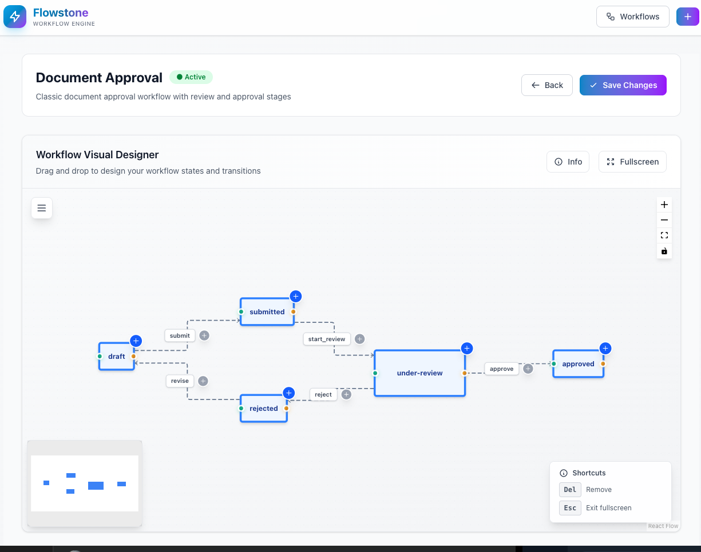
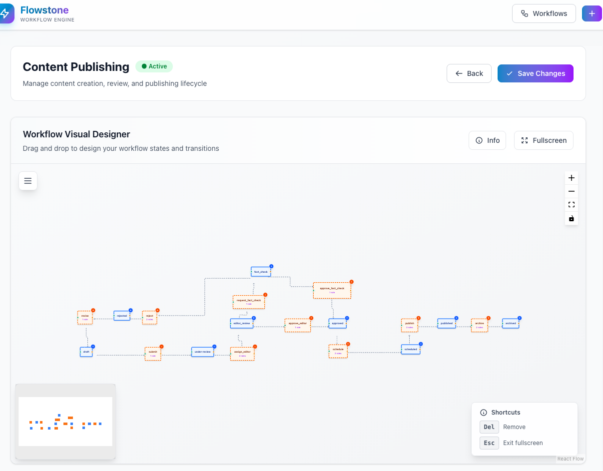

# Workflow Visual Designer

Flowstone includes a powerful visual workflow designer built with React Flow. This drag-and-drop interface allows you to create, edit, and visualize your workflow states and transitions interactively.

This page covers the visual designer features, building the UI bundle, publishing assets, and configuration.

## Prerequisites

- Node.js 18+ (for local builds)
- PHP/Laravel app where Flowstone is installed
- Livewire is optional (UI will render a message if not present)

## Build the UI bundle

The UI is built with Vite as a UMD library exposing `window.FlowstoneUI.mount(el, graph)`.

```bash
# From the package root
npm ci
npm run build
```

This generates the bundle under `dist/`:

- `dist/flowstone-ui.js` — main UI bundle (expects React and ReactDOM globals)
- `dist/flowstone-ui.css` — styles (includes React Flow styles)

## Publish assets

Publish the built assets to your host app's `public/vendor/flowstone` directory.

```bash
php artisan vendor:publish --tag=flowstone-ui-assets
```

Alternatively, use the convenience command:

```bash
php artisan flowstone:publish-assets
```

## Layout configuration

The Flowstone layout loads assets from `config('flowstone.ui.asset_url')` (default: `/vendor/flowstone`).

It also loads React and ReactDOM as externals to keep the bundle small:

```html
<script src="https://unpkg.com/react@18/umd/react.production.min.js" crossorigin="anonymous"></script>
<script src="https://unpkg.com/react-dom@18/umd/react-dom.production.min.js" crossorigin="anonymous"></script>
<link rel="stylesheet" href="/vendor/flowstone/flowstone-ui.css" />
<script src="/vendor/flowstone/flowstone-ui.js" defer></script>
```

If you prefer to self-host React and ReactDOM, copy them to your own public folder and update the script tags accordingly.

## Using the Visual Designer

### Accessing the Designer

1. Navigate to `/flowstone` (configurable via `flowstone.ui.path`)
2. Select a workflow from the dashboard
3. Click the **Designer** button to open the visual workflow designer

#### Screenshots





### Designer Features

The visual designer provides an intuitive drag-and-drop interface for workflow management:

#### Canvas Controls

- **Zoom In/Out**: Use the `+` and `-` buttons or mouse wheel
- **Fit to Screen**: Click the fullscreen icon to auto-fit the workflow
- **Pan**: Click and drag the canvas background
- **Fullscreen Mode**: Press `Esc` or click fullscreen button

#### Working with States (Places)

States are represented as blue boxes on the canvas:

- **View State**: Each state shows its name and order
- **Add State**: Drag from the sidebar or use the add button
- **Edit State**: Click on a state to edit its properties
- **Remove State**: Press `Del` key or click remove icon
- **Reorder**: States show their order number for clarity

#### Working with Transitions

Transitions are represented as dashed lines with labels between states:

- **View Transition**: Shows transition name on the connecting line
- **Add Transition**: Connect two states by dragging
- **Edit Transition**: Click on a transition to edit
- **Manage Metadata**: Click transition to add roles, labels, and permissions
- **Remove Transition**: Select and press `Del` key

#### Keyboard Shortcuts

- `Del` - Remove selected node/transition
- `Esc` - Exit fullscreen mode

### Managing Metadata

#### Workflow Metadata

Click **+ Manage** in the Workflow Metadata section to add:
- **Role**: Define access control roles
- **Permission**: Set permission requirements
- **Custom Fields**: Add any key-value pairs

#### Transition Metadata

Click on any transition to manage:
- **Roles**: Array of roles that can perform this transition (e.g., `["fact_checker"]`)
- **Label**: Human-readable transition name (e.g., "Verify Facts")
- **Description**: Detailed explanation of the transition
- **Custom Metadata**: Additional key-value pairs

#### Place Metadata

Click on any state/place to configure:
- **Label**: Display name for the state
- **Description**: State description
- **Order**: Display order in lists
- **Custom Fields**: Additional metadata

### Visual Graph

The visual designer uses React Flow to display your workflow as an interactive graph:

- **Blue Nodes**: Represent states (places) in the workflow
- **Orange Nodes**: Represent transition actions or guards
- **Solid Blue Lines**: Active connections
- **Dashed Lines**: Potential transitions
- **Minimap**: Bottom-left corner shows overview of large workflows

### Saving Changes

Click **Save Changes** button to persist your workflow design to the database. The visual layout is stored in the `designer` column of the workflows table.

## CI build (optional)

Use the provided GitHub Action workflow to build and attach `dist/` artifacts to a release. This lets users publish assets without local Node setup.

- On GitHub, create a new release (tag). The workflow will:
  - Check out the repository
  - Install Node dependencies
  - Run `npm run build`
  - Upload `dist/` to the release assets

See `.github/workflows/release-build.yml`.
